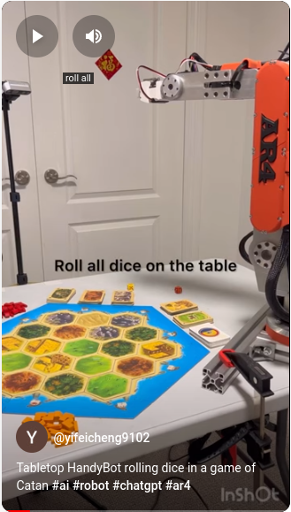
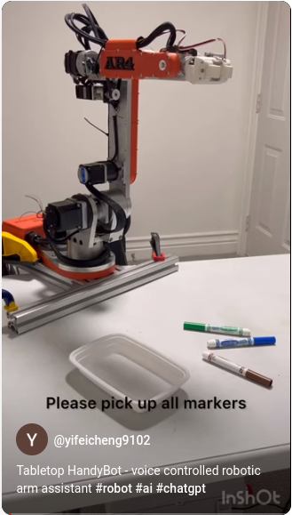
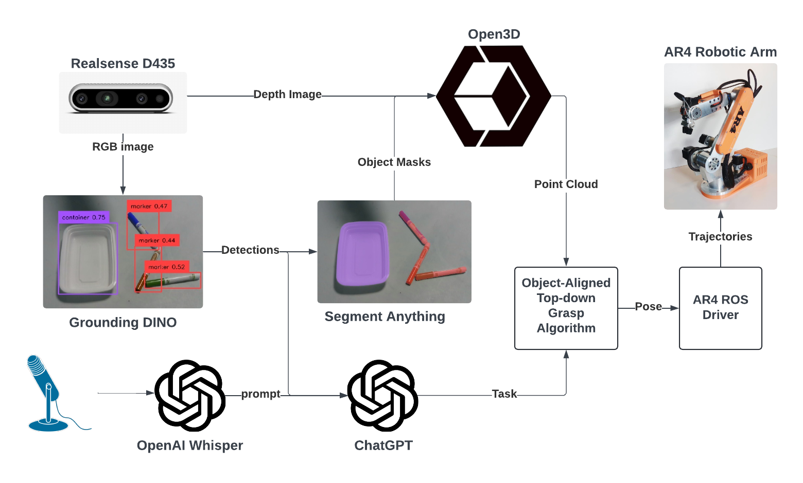

# Tabletop HandyBot

A low-cost AI powered robotic arm assistant that listens to your voice commands
and can carry out a variety of tabletop tasks. Currently it can pick and place
arbitrary objects presented in front of it. The total BOM is around $2300 USD.

## Video Demo

<div align="center">

|                                       Rolling Dice                                       |                                        Picking Markers                                         |
| :--------------------------------------------------------------------------------------: | :--------------------------------------------------------------------------------------------: |
| [](https://youtube.com/shorts/xAmPpvCZZU4) | [](https://youtube.com/shorts/fsCkS7HvgGo) |

</div>

## System Architecture



### Technology Used

- [AR4 Robot](https://www.anninrobotics.com/): a $2000 robot arm that can lift 5lb dumbbells
  - [ar4_ros_driver](https://github.com/ycheng517/ar4_ros_driver): ROS driver for the arm
- [Realsense D435](https://store.intelrealsense.com/buy-intel-realsense-depth-camera-d435.html?_ga=2.156205052.639062113.1715864879-1357777019.1715864879): a reliable $300 RGBD camera
  - [realsense-ros](https://github.com/IntelRealSense/realsense-ros): ROS wrapper for the camera
- [Whisper Mic](https://github.com/mallorbc/whisper_mic): Convenient library for using OpenAI Whisper with a microphone
- [Grounding DINO](https://github.com/IDEA-Research/Grounded-Segment-Anything/tree/main/GroundingDINO) A SOTA zero-shot object detector that can detect any object.
- [Segment Anything](https://github.com/IDEA-Research/Grounded-Segment-Anything/tree/main/segment_anything): A SOTA zero-shot object segmentation model that can segment any object.
- [OpenAI Assistants](https://platform.openai.com/docs/assistants/overview): an API that calls ChatGPT with specific instructions and function calls

## Setup

### Pre-requisites

You should have [ROS 2 Iron](https://docs.ros.org/en/iron/index.html) installed on Ubuntu 22.04.

The follow hardware is is used. The use of other hardware will require adapting the codebase.

- [AR4 robot arm](https://www.anninrobotics.com/) with [AR servo gripper](https://www.anninrobotics.com/product-page/servo-gripper-parts-kit)
- [Intel RealSense D435 Depth Camera](https://www.intelrealsense.com/depth-camera-d435/)

You should be able to run [ar4_ros_driver](https://github.com/ycheng517/ar4_ros_driver)
with the gripper, and successfully perform hand-eye calibration.

### Install

Import dependent repos

```bash
vcs import . --input tabletop-handybot.repos
```

Create a virtual environment, i.e.

```bash
pyenv virtualenv 3.10.12 handybot
```

Go to the `./Grounded-Segment-Anything/Grounded-Segment-Anything/` sub-directory
and setup [Grounded-Segment-Anything](https://github.com/IDEA-Research/Grounded-Segment-Anything)
in the virtualenv. Ensure you can run the [grounded_sam.ipynb](https://github.com/IDEA-Research/Grounded-Segment-Anything/blob/main/grounded_sam.ipynb)
notebook.

Install Python dependencies not in the ROS Index

```bash
pip install -r requirements.txt
```

Build and source the project

```bash
colcon build
source install/setup.bash
```

### Run

Launch the AR4

```bash
ros2 launch ar_hardware_interface ar_hardware.launch.py calibrate:=True include_gripper:=True
```

Launch all other programs

```bash
ros2 launch tabletop_handybot run.launch.py
```

If all things are looking good, then you can try publishing a prompt to the
`/prompt` topic for the robot to execute, i.e:

```bash
ros2 topic pub --once /prompt std_msgs/msg/String "data: 'put the marker in the container'"
```

If you have a microphone attached to the computer, you can publish a message
to the `/listen` topic, and then say your prompt.

```bash
ros2 topic pub --once /listen std_msgs/msg/Empty "{}"
```
